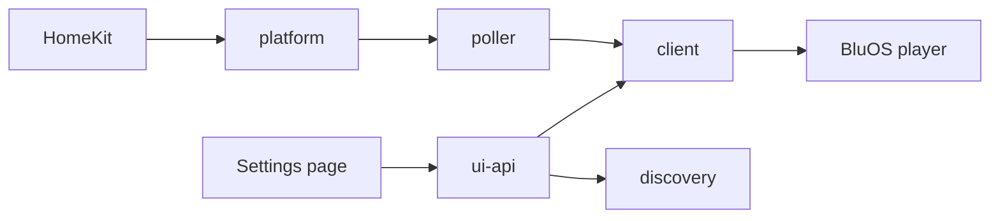

# Development

HomeKit talks to the platform. The platform owns accessory identity and starts one poller per zone. Each poller long-polls through the client; the client is the only place that talks to a player. Accessories render the last observation as HAP.



`src/api/` is the wire. `src/devices/` is HomeKit. `src/platform.ts` is the join. Protocol facts live in [docs/PROTOCOL.md](docs/PROTOCOL.md), not here.

`dist/` is committed so a git install works. CI fails if it drifts from `src/`. Run `npm run build` and commit `dist/` with every source change. There is no `prepare` script: it would dirty the tree on every `npm install`. `prepublishOnly` still rebuilds.

## Invariants

Break these and you break someone's rooms, or you guess the protocol.

- **Identity is `MAC:port:kind` (plus preset level), never the address.** A DHCP change must not mint new accessories. Adopt a cached accessory that matches identity; do not replace it. Changing a preset's level *is* a new accessory.
- **Bad config disables the platform. It does not unregister anything.** Rooms and automations survive a typo. One bad `devices[]` entry is skipped; only a wholly unusable config is fatal.
- **Unknown is No Response**, not zero. Until a real `/SyncStatus` arrives, and again when the player stops answering, characteristics report `SERVICE_COMMUNICATION_FAILURE`. *One exception, in the reboot switches:* they always read `false` and stay pressable. The rule exists so automations cannot fire against invented **readings**, and a button reports no reading. `false` honestly means "not pressed", whether or not the player is answering. A No Response tile cannot be pressed in the Home app, which would grey out the reboot button in exactly the situation it is for. Adding a second exception needs the same standard of argument.
- **Mute is inferred from `muteVolume` / `muteDb`.** `/SyncStatus` never sends `mute`. `volume="0" db="-100"` is the same for mute and for level zero. See PROTOCOL.md.
- **`tell_slaves` is decided in one place** (`BaseAccessory.writeScope`): a group leader carries the group, everyone else writes locally. Do not special-case it per accessory.
- **Rate rules live in `api/client.ts`.** One second between same-resource calls, 100 ms between control calls, writes serialised per chassis. Call through the client; do not open your own HTTP. *The per-chassis lock has one exemption:* reboot skips it. That lock protects one address from rapid, repeated volume and mute traffic; reboot is one request per box per press, and holding the lock would only make a box that dies mid-response delay whatever queued behind it by a full timeout. The one-second same-resource gap still applies, keyed on the host.

- **Reboot is addressed by host, not by endpoint**, and is the only call that is. It is served on port 80, the box's own web server, and answers 404 on the control ports, so `BluOSClient.reboot` takes a bare host and there is no way to restart one zone of a multi-zone chassis. Anything resolving reboot targets de-duplicates on host for that reason, not for tidiness: a second request would land on a box that is already going down. See [docs/PROTOCOL.md](docs/PROTOCOL.md) for the measurements.
- **Hardware wins the spec.** Record the measurement in PROTOCOL.md and pin a fixture. Never commit a raw capture. [scripts/README.md](scripts/README.md) is the pseudonymise path, and `tests/unit/fixtures.test.ts` allowlists every address and MAC in the tree.

A capability ships if HomeKit can express it as a tile, a scene, an automation or a spoken command. A library, a queue and artwork cannot, so they stay in the BluOS app.

## Commands

Node 22, 24 or 26, matching `engines`. CI runs 22 / 24 / 26 and a runtime `npm audit`. `@types/node` tracks the top of that range rather than its floor, so the Node 22 job in the matrix is what catches an API the oldest supported runtime does not have. Dependabot is told not to raise it on its own, because the range and the types are meant to move together.

```bash
npm install
npm run build                          # commit dist/ with the source
npm run lint                           # warnings are failures
npx tsc --noEmit -p tsconfig.test.json # src + tests
npm test                               # jest with coverage (NODE_ENV=test)
```

The suite never touches the network. Before a release, against real players (read-only):

```bash
npm run build
node scripts/smoke.js
node scripts/grouping.js
```

Tests inject fakes. `tests/helpers/hap.ts` is the HAP stand-in. `api/http.ts` is the one module tested against a loopback socket. Coverage includes `homebridge-ui/` and is gated at 80%. Fake timers, not real sleeps. Module mocks are plain classes behind a getter, because `resetMocks` strips `mockImplementation` on a factory.

## Adding a capability

1. Verify the endpoint on a real player. If it disagrees with the spec, write it down in PROTOCOL.md first.
2. Parse in `src/api/sync-status.ts`, call through `BluOSClient`.
3. Add a `BaseAccessory` subclass under `src/devices/`.
4. Extend `config.schema.json`, the config types, and `validateConfig` / `resolveAccessories`. Constrain the schema to what the plugin will accept. `required` must be an array of property names on the object (draft-07); a boolean on a field fails Homebridge verification CI.
5. Wire `attachHandler` in `platform.ts`. Extend the identity key only if the new accessory needs more than `kind`. An accessory that belongs to the install instead of to a player uses `PLATFORM_DEVICE_ID` and gets no poller, so it must resolve whatever it needs at the moment it is used. `RebootAllAccessory` is the one example.
6. Tests for the parser, the client method, the accessory and the config path. A new response shape needs a recorded fixture.
7. Update PROTOCOL.md and [docs/FEATURES.md](docs/FEATURES.md).
8. `npm run build` and commit `dist/`.
